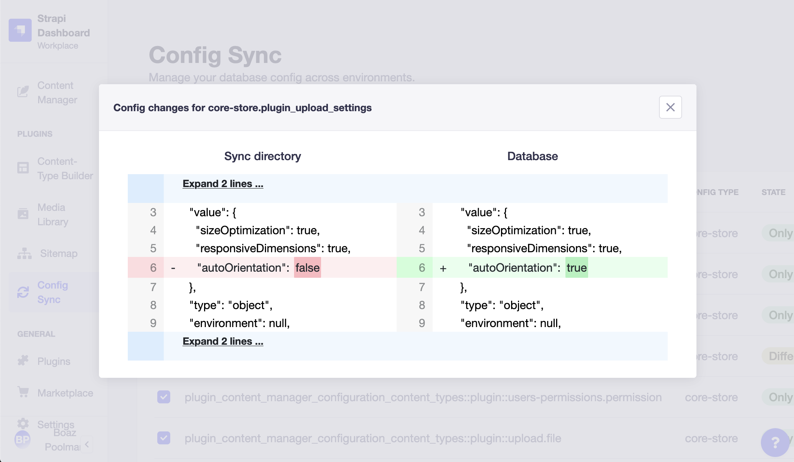

# Strapi Plugin Config Sync

A lot of configuration of your Strapi project is stored in the database. Like core_store, user permissions, user roles & webhooks. Things you might want to have the same on all environments. But when you update them locally, you will have to manually update them on all other environments too.

That's where this plugin comes in to play. It allows you to export these configs as individual JSON files for each config, and write them somewhere in your project. With the configs written in your filesystem your can keep track of them through version control (git), and easily pull and import them across environments.

Importing, exporting and keeping track of config changes is done in the admin page of the plugin.

*Currently only the core_store changes are being tracked.*

**THIS PLUGIN IS STILL IN DEVELOPMENT**

**PLEASE USE WITH CARE**

## Installation

Use `npm` or `yarn` to install and build the plugin.

	yarn add strapi-plugin-config-sync
	yarn build
	yarn develop

## Configuration
Some settings for the plugin are able to be modified by creating a file `extensions/config-sync/config/config.json` and changing the following settings:

#### `destination`

The path for reading and writing the config JSON files.

> `required:` NO | `type:` string | `default:` extensions/config-sync/files/

#### `minify`

Setting to minify the JSON that's being exported. It defaults to false for better readability in git commits.

> `required:` NO | `type:` bool | `default:` false

#### `importOnBootstrap`

Allows you to let the config be imported automaticly when strapi is bootstrapping (on `yarn start`). This setting should only be used in production, and should be handled very carefully as it can unintendedly overwrite the changes in your database.

PLEASE USE WITH CARE.

> `required:` NO | `type:` bool | `default:` false

#### `exclude`

You might not want all your database config exported and managed in git. This settings allows you to add an array of config names which should not be tracked by the config-sync plugin.

For now only the `core_store` table is being tracked. Add the `key` value of a `core_store` item to the array to exclude it from being tracked.

> `required:` NO | `type:` array | `default:` []

## TODOs
- Exporting of user roles & permissions
- Exporting of webhooks
- Specify which tables you want to track in the plugin configurations
- Add partial import/export functionality
- Add CLI commands for importing/exporting

## Resources

- [MIT License](LICENSE.md)

## Links

- [NPM package](https://www.npmjs.com/package/strapi-plugin-config-sync)
- [GitHub repository](https://github.com/boazpoolman/strapi-plugin-config-sync)

## ⭐️ Show your support

Give a star if this project helped you.
